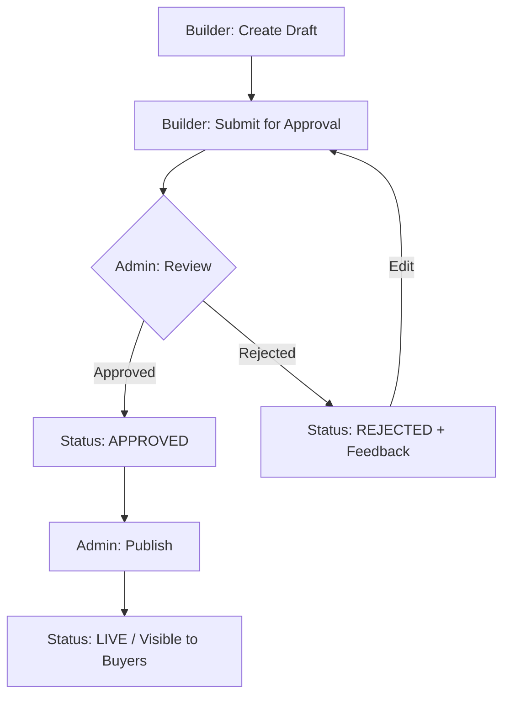
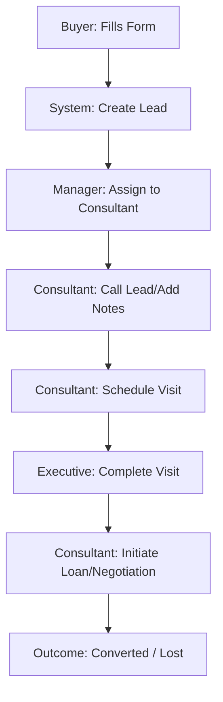

# PropertyHub - Complete System Documentation

This document provides a comprehensive overview of the PropertyHub platform, including its architecture, data models, user roles, core features, and technical stack. This document is designed to give an AI (like ChatGPT) a complete understanding of the system.

---

## 🏗️ System Architecture

PropertyHub is a full-stack platform consisting of several key components:

1.  **Backend (property-hub-backend)**:
    - **Framework**: NestJS built on Fastify for high performance.
    - **ORM**: Prisma for type-safe database access.
    - **Database**: PostgreSQL.
    - **Task Queue**: BullMQ for handling background jobs (notifications, scraping).
    - **API**: RESTful API with Swagger documentation.

2.  **Frontend (property-hub-frontend)**:
    - **Framework**: Next.js (App Router).
    - **Styling**: Tailwind CSS 4.
    - **Real-time**: LiveKit for video consultations and real-time features.

3.  **Specialized Components**:
    - **RERA Scraper (property-hub-rera-scraper)**: A dedicated service for scraping and syncing RERA (Real Estate Regulatory Authority) data.
    - **Integrations**: 
        - **Exotel**: For telephonic integrations and call logging.
        - **Razorpay**: For payment gateway and subscriptions.
        - **Instagram**: For publishing and managing property Reels.
        - **LiveKit**: For video-based virtual property tours and consultations.

---

## 👥 User Roles & Dashboards

The system follows a role-based access control (RBAC) model. Each role has a dedicated dashboard and specific permissions.

| Internal Role (Prisma) | Frontend Alias | Primary Responsibility | Dashboard Route |
| :--- | :--- | :--- | :--- |
| `CENTRAL_AUTHORITY` | Admin | Overall platform management, entity approval. | `/central-authority/dashboard` |
| `PROPERTY_PARTNER` | Builder / Developer | Submitting and managing properties/projects. | `/property-partner/dashboard` |
| `BROKER` | Broker | Managing leads and property sales. | `/broker/dashboard` |
| `BUYER` | Homebuyer | Searching for properties, expert guidance. | `/dashboard` |
| `CONSULTANT` | Expert Guide | Guiding buyers, matching them with properties. | `/consultant/dashboard` |
| `INFLUENCER` | Content Creator | Promoting properties via Reels/social media. | `/influencer/dashboard` |
| `LOAN_ADVISOR` | Loan Advisor | Managing loan applications and bank coordination. | `/loan-advisor/dashboard` |
| `ONBOARDING_MANAGER` | Onboarding | Managing property/user onboarding processes. | `/onboarding-manager/dashboard` |
| `MARKETING_MANAGER` | Marketing Specialist | Managing ad campaigns and leads. | `/marketing-manager/dashboard` |
| `VISIT_EXECUTIVE` | Field Executive | Coordinating and completing site visits. | `/visit-executive/dashboard` |

---

## 📊 Core Data Models (Prisma)

The system's "Ground Truth" is defined in `prisma/schema.prisma`. Key entities include:

### 🏢 Entities & Users
- **Organization**: Can be of type `PLATFORM`, `PROPERTY_PARTNER`, `BROKERAGE`, or `MARKETING_AGENCY`.
- **User**: Stores profile data, primary roles, and relationship to organizations.
- **Invitation**: System for inviting new users with specific roles.

### 🏠 Property Management
- **Project**: Represents a real estate project (Apartment, Villa, Plot, Commercial).
- **PropertyUnit**: Individual units within a project (price, area, status).
- **ReraProject**: Data synced from official RERA sources for verification.

### 📈 Lead & Sales Funnel
- **Lead**: Captured potential buyers with source tracking and assignment.
- **LeadNote**: Contextual notes added by consultants/managers.
- **Visit**: Scheduled site visits for leads.
- **CallLog**: Integration with Exotel for tracking conversations.
- **Commission**: Tracking payouts for brokers and partners.

### 💳 Financials & Subscriptions
- **PaymentOrder**: Tracking Razorpay transactions.
- **SubscriptionMode**: `FREE` vs `PAID` at the Organization level.
- **Loan**: Tracking loan applications for leads.

### 📱 Content & Engagement
- **Reel**: Short video content for property promotion (Instagram integration).
- **Review**: User testimonials and project reviews.
- **MarketingCampaign**: Tracking ad spend and conversion (Impressions, Clicks, Leads).

---

## 🔄 Core Workflows

### 1. Property Lifecycle


### 2. Lead Management Workflow


### 3. Subscription & Premium Features
- Organizations start on `FREE` mode.
- Certain features (e.g., specific stats, bulk exports) are locked behind `PAID` mode.
- `CENTRAL_AUTHORITY` can "Gift Premium" status manually or through the portal.
- Integrated with Razorpay for automated billing.

---

## 🛠️ Technical Stack & Dependencies

### Backend
- **Core**: NestJS (@nestjs/core, @nestjs/common)
- **Engine**: Fastify (@nestjs/platform-fastify)
- **Database**: Prisma + PostgreSQL
- **Async Workers**: BullMQ (@nestjs/bullmq)
- **Communication**: Nodemailer, LiveKit Server SDK, Razorpay Node SDK
- **Scraping**: Playwright, Cheerio
- **Storage**: AWS S3 (@aws-sdk/client-s3)

### Frontend
- **Framework**: Next.js 16 (App Router)
- **UI Components**: React 19, Radix UI (assumed from shadcn pattern)
- **Styling**: Tailwind CSS 4
- **State/Data**: Axios for API calls, React Hot Toast for notifications
- **Real-time Visuals**: LiveKit Components React

---

## 📂 Project Structure

```text
/
├── property-hub-backend/      # NestJS API
│   ├── src/
│   │   ├── modules/           # Domain-driven modules (leads, projects, users, etc.)
│   │   ├── common/            # Global filters, interceptors, etc.
│   │   └── main.ts            # Entry point
│   ├── prisma/
│   │   └── schema.prisma      # Database definition
│   └── scripts/
│       └── seed-data.ts       # Test data seeding
├── property-hub-frontend/     # Next.js Application
│   ├── app/                   # App router pages (dashboard/, admin/, etc.)
│   ├── components/            # Shared UI components
│   └── lib/                   # Utilities and configuration
└── property-hub-rera-scraper/ # Dedicated scraping service
```

---

## 📜 Key Configuration Files
- **Backend .env**: Database URL, JWT Secret, AWS Credentials, Razorpay Keys, Exotel SID, LiveKit API Key.
- **Frontend .env.local**: API Base URL, LiveKit URL.

---

## 🧪 Testing Credentials
See `test-users-credentials.md` in the root for a list of test accounts available for all roles. Password for all is typically `password123`.

---
**Last Updated**: March 2026
**Version**: 2.0 (Full Implementation State)
